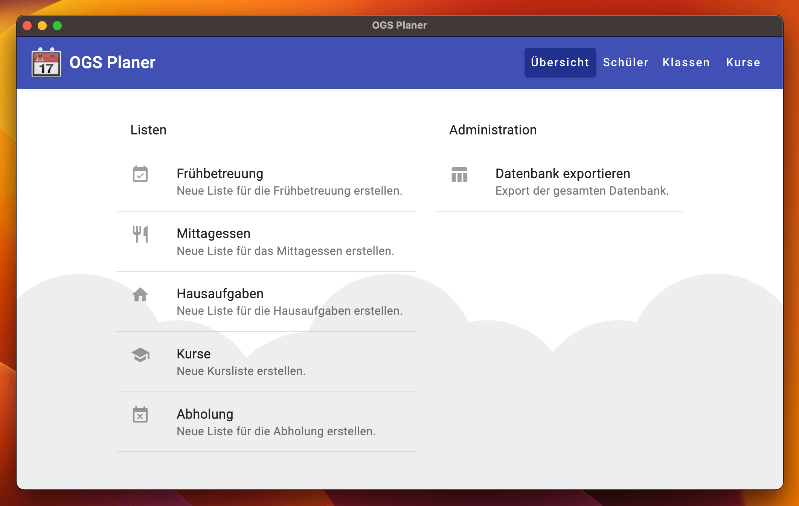

# 📆 OGS Planer

Planungstool für den Ganztagsbereich einer Grundschule

## Vorschau

## Über das Projekt

Das Ziel des Projekts ist es die Planung des offenen Ganztagsbereichs einer Grundschule zu erleichtern. Die App ermöglicht das Erfassen der Stammdaten von Schülern und deren Teilnahme an Aktivitäten wie Frühbetreuung, Mittagessen, Hausaufgabenbetreuung und Kursangeboten. Basierend auf den erfassten Daten können dann automatisch Excel- oder PDF-Listen erzeugt werden, welche alle teilnehmenden Schüler einer Aktivität in einem bestimmten Zeitraum abbilden. PDF-Listen sind druckoptimiert (Seitenzahl, Erstellungsdatum im Footer, automatisches Querformat bei vielen Spalten) und eignen sich für Elternkommunikation und Aushang.

Technisch handelt es sich um eine Web-App bestehend aus [Angular](https://angular.io/) Frontend und [Node.js](https://nodejs.org/) Backend, welche mittels [Electron](https://www.electronjs.org/) als Desktopanwendung verfügbar gemacht wird. Als lokale Datenbank wird [SQLite](https://www.sqlite.org/) verwendet.

## Erste Schritte

Um das Projekt lokal zum Laufen zu bringen, muss man nur das Repository mit [VS Code](https://code.visualstudio.com/) öffnen, alle empfohlenen Erweiterungen installieren und `npm install` ausführen, um alle erforderlichen Abhängigkeiten zu installieren. Anschließend muss noch `npm run rebuild` für SQLite ausgeführt werden.

### Git Hooks

Das Projekt umfasst clientseitige Pre-Commit Git Hooks unter Verwendung von [husky](https://github.com/typicode/husky) und [lint-staged](https://github.com/okonet/lint-staged). Nach der Installation aller Projektabhängigkeiten werden damit Prettier und Linter automatisch vor jedem Commit ausgeführt.

### Lokaler Entwicklungsserver

Führt man `npm start` oder `ng serve` aus, so erhält man einen lokalen Entwicklungsserver auf dem die UI unter `http://localhost:4200/` im Browser erreichbar ist. Die Anwendung wird dabei automatisch neu geladen, wenn eine der Quelldateien geändert wird. Die Datenbank ist auf diese Weise allerdings nicht erreichbar, da die SQLite DB nur mit dem Electron Build ausgeliefert wird, weshalb dieser Ansatz nur für UI Anpassungen zu empfehlen ist.

Für das lokale Starten der gesamten Anwendung kann `npm run electron` ausgeführt werden. Dabei wird zunächst der Angular und anschließend der Electron Build erzeugt und die komplett funktionsfähige Anwendung gestartet. Bei Quellcode Änderungen startet sich hier die App allerdings nicht automatisch neu.

### Erstellen von UI Komponenten

Führt man `ng generate component component-name` aus, so wird eine neue Angular Komponente erzeugt. Auf die gleiche Art und Weise kann `ng generate directive|pipe|service|class|guard|interface|enum|module` verwendet werden.

### Build erzeugen

Mittels `npm run build` oder `ng build` kann der Angular UI Build erstellt werden. Die Build-Artefakte werden im Verzeichnis `dist/` gespeichert.

Durch Ausführen von `npm run make` kann der gesamte Electron Build erzeugt werden. Die Build-Artefakte werden im Verzeichnis `out/` gespeichert.

### Code Formatierung

`npm run prettier` kann ausgeführt werden, um nach um mithilfe von Prettier nach Formatierungsproblemen zu suchen und `npm run prettier:fix`, um zu versuchen diese Fehler automatisch zu beheben.

### Code Linting

`npm run lint` kann ausgeführt werden, um mithilfe von ESLint nach Code Problemen zu suchen und `npm run lint:fix`, um zu versuchen diese Fehler automatisch zu beheben.

### Unit Tests ausführen

Durch `npm run test` oder `ng test` können die UI Unit Tests über [Karma](https://karma-runner.github.io) im Watch-Modus ausgeführt werden. Mittels `npm run test:coverage` werden alle Unit Tests inklusive Code Coverage Reporting ausgeführt. Der Report wird im Verzeichnis `coverage/` gespeichert.
