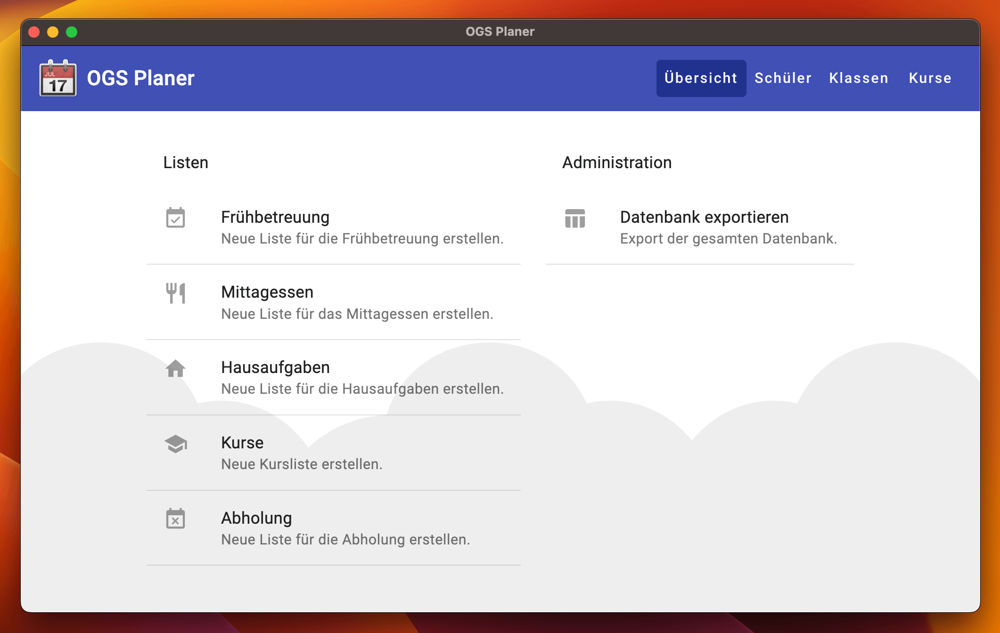

# 📆 OGS Planer

Planungstool für den Ganztagsbereich einer Grundschule

## Vorschau

## Über das Projekt

Das Ziel des Projekts ist es die Planung des offenen Ganztagsbereichs einer Grundschule zu erleichtern. Die App ermöglicht das Erfassen der Stammdaten von Schülern und deren Teilnahme an Aktivitäten wie Frühbetreuung, Mittagessen, Hausaufgabenbetreuung und Kursangeboten. Basierend auf den erfassten Daten können dann automatisch Excel-Listen erzeugt werden, welche alle teilnehmenden Schüler einer Aktivität in einem bestimmten Zeitraum abbilden.

Technisch handelt es sich um eine Web-App bestehend aus [Angular](https://angular.io/) Frontend und [Node.js](https://nodejs.org/) Backend, welche mittels [Electron](https://www.electronjs.org/) als Desktopanwendung verfügbar gemacht wird. Als lokale Datenbank wird [SQLite](https://www.sqlite.org/) verwendet.

## Installation

Anwendungspakete werden für jedes Betriebssystem auf einem eigenen CI-Runner erzeugt, da Electron Forge immer nur die zur Plattform passenden Pakete bauen kann und die SQLite-Anbindung nativ pro Plattform kompiliert werden muss. Die Veröffentlichung erfolgt manuell.

| Betriebssystem | Datei                            | Hinweis                                                          |
| -------------- | -------------------------------- | ---------------------------------------------------------------- |
| Windows        | `OGS Planer-*  Setup.exe`        | Installer, richtet Startmenü- und Desktop-Verknüpfung ein        |
| Windows        | `OGS Planer-win32-x64-*.zip`     | Ohne Installation: entpacken und `ogs-planer-app.exe` starten    |
| macOS          | `OGS Planer-darwin-arm64-*.zip`  | Entpacken und `OGS Planer.app` in den Programme-Ordner ziehen    |
| Linux          | `*.deb` / `*.rpm`                |                                                                  |

Die ZIP-Variante für Windows ist für Rechner gedacht, auf denen keine Software installiert werden darf – der entpackte Ordner ist sofort lauffähig.

> **Hinweis zu Windows SmartScreen:** Die Anwendungspakete sind nicht signiert. Windows zeigt beim ersten Start deshalb die Warnung „Der Computer wurde durch Windows geschützt“. Über _Weitere Informationen_ → _Trotzdem ausführen_ lässt sich die App starten.

### Datenbank und Sicherung

Die SQLite-Datenbank liegt **nicht** im Installationsverzeichnis, sondern im Benutzerprofil:

| Betriebssystem | Pfad                                                    |
| -------------- | ------------------------------------------------------- |
| Windows        | `%APPDATA%\OGS Planer\mysqlite.db`                      |
| macOS          | `~/Library/Application Support/OGS Planer/mysqlite.db`  |
| Linux          | `~/.config/OGS Planer/mysqlite.db`                      |

Das ist wichtig, weil der Windows-Installer jede Version in einen eigenen `app-<version>` Ordner legt und diesen beim nächsten Update ersetzt. Läge die Datenbank dort, wären bei jedem Update alle erfassten Daten verloren. Die im Anwendungspaket enthaltene `mysqlite.db` dient nur noch als Vorlage und wird beim ersten Start einmalig in das Benutzerprofil kopiert.

Über das Dashboard lässt sich die Datenbank jederzeit exportieren (_Datenbank exportieren_) und aus einem solchen Export wiederherstellen (_Datenbank importieren_). Der Import überschreibt den kompletten Datenbestand und startet die Anwendung anschließend neu.

> **Beim Update von einer Version vor 2.0.0:** Ältere Versionen haben die Daten noch im Anwendungsverzeichnis gespeichert. Vor dem Update also unbedingt _Datenbank exportieren_ ausführen und die Sicherung nach dem Update über _Datenbank importieren_ einlesen.

## Erste Schritte

Um das Projekt lokal zum Laufen zu bringen, muss man nur das Repository mit [VS Code](https://code.visualstudio.com/) öffnen, alle empfohlenen Erweiterungen installieren und `npm install` ausführen, um alle erforderlichen Abhängigkeiten zu installieren. Anschließend muss noch `npm run rebuild` für SQLite ausgeführt werden.

### Git Hooks

Das Projekt umfasst clientseitige Pre-Commit Git Hooks unter Verwendung von [husky](https://github.com/typicode/husky) und [lint-staged](https://github.com/okonet/lint-staged). Nach der Installation aller Projektabhängigkeiten werden damit Prettier und Linter automatisch vor jedem Commit ausgeführt.

### Lokaler Entwicklungsserver

Führt man `npm start` oder `ng serve` aus, so erhält man einen lokalen Entwicklungsserver auf dem die UI unter `http://localhost:4200/` im Browser erreichbar ist. Die Anwendung wird dabei automatisch neu geladen, wenn eine der Quelldateien geändert wird. Die Datenbank ist auf diese Weise allerdings nicht erreichbar, da die SQLite DB nur mit dem Electron Build ausgeliefert wird, weshalb dieser Ansatz nur für UI Anpassungen zu empfehlen ist.

Für das lokale Starten der gesamten Anwendung kann `npm run electron` ausgeführt werden. Dabei wird zunächst der Angular und anschließend der Electron Build erzeugt und die komplett funktionsfähige Anwendung gestartet. Bei Quellcode Änderungen startet sich hier die App allerdings nicht automatisch neu.

### Erstellen von UI Komponenten

Führt man `ng generate component component-name` aus, so wird eine neue Angular Komponente erzeugt. Auf die gleiche Art und Weise kann `ng generate directive|pipe|service|class|guard|interface|enum|module` verwendet werden.

### Build erzeugen

Mittels `npm run build` oder `ng build` kann der Angular UI Build erstellt werden. Die Build-Artefakte werden im Verzeichnis `dist/` gespeichert.

Durch Ausführen von `npm run make` kann der gesamte Electron Build erzeugt werden. Die Build-Artefakte werden im Verzeichnis `out/` gespeichert.

Electron Forge erzeugt dabei immer nur die Pakete, die zum aktuellen Betriebssystem passen: unter Windows den Squirrel-Installer und ein ZIP, unter macOS ein ZIP, unter Linux `.deb` und `.rpm`. Ein vollständiger Satz an Anwendungspaketen entsteht deshalb nur in der CI, wo auf allen drei Betriebssystemen parallel gebaut wird (siehe `.github/workflows/ci.yml`).

Unter Windows wird der Anwendungsinhalt zusätzlich in ein `app.asar` Archiv gepackt. Das reduziert die Anzahl der installierten Dateien erheblich, was dort Installation und den ersten Virenscan spürbar beschleunigt. Die native SQLite-Bibliothek bleibt dabei bewusst außerhalb des Archivs (`app.asar.unpacked`), da Windows keine DLL aus einem Archiv laden kann.

Der `overrides` Eintrag in der `package.json` hebt `@electron/rebuild` auf Version 4 an. Electron Forge 7 bringt sonst eine ältere Version mit, deren gebündeltes `node-gyp` Visual Studio 2026 nicht kennt – und genau das ist auf dem `windows-latest` Runner installiert. Ohne den Override schlägt das Kompilieren von `better-sqlite3` unter Windows mit `Could not find any Visual Studio installation to use` fehl.

### Code Formatierung

`npm run prettier` kann ausgeführt werden, um nach um mithilfe von Prettier nach Formatierungsproblemen zu suchen und `npm run prettier:fix`, um zu versuchen diese Fehler automatisch zu beheben.

### Code Linting

`npm run lint` kann ausgeführt werden, um mithilfe von ESLint nach Code Problemen zu suchen und `npm run lint:fix`, um zu versuchen diese Fehler automatisch zu beheben.

### Unit Tests ausführen

Durch `npm run test` oder `ng test` können die UI Unit Tests über [Karma](https://karma-runner.github.io) im Watch-Modus ausgeführt werden. Mittels `npm run test:coverage` werden alle Unit Tests inklusive Code Coverage Reporting ausgeführt. Der Report wird im Verzeichnis `coverage/` gespeichert.
